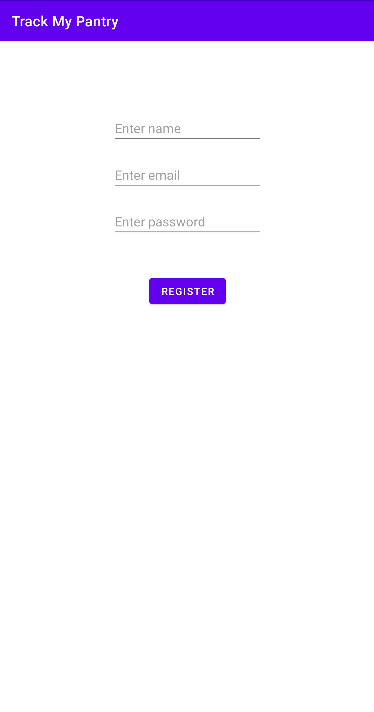
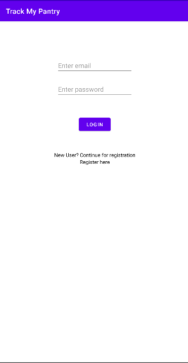
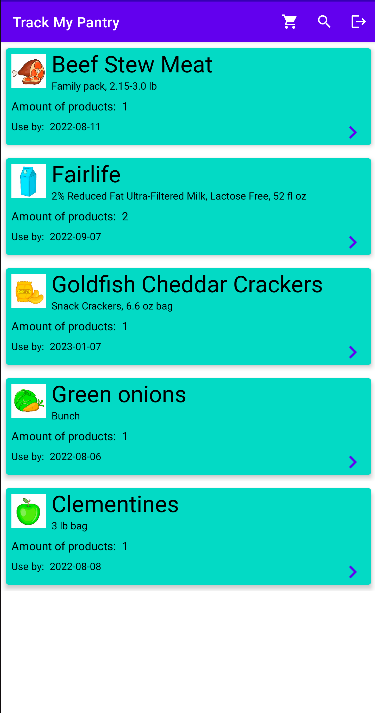
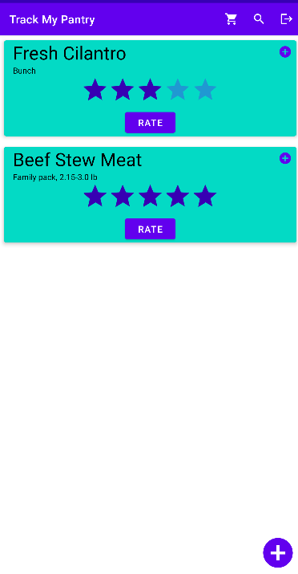
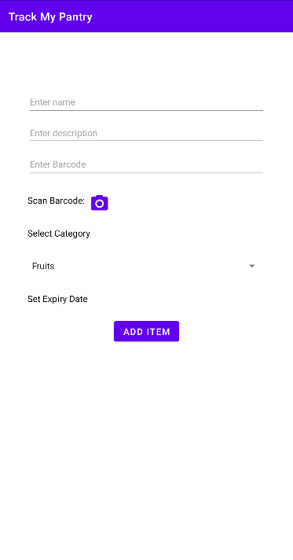
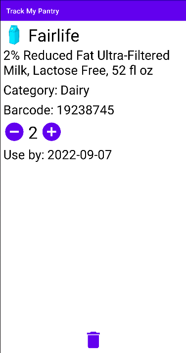
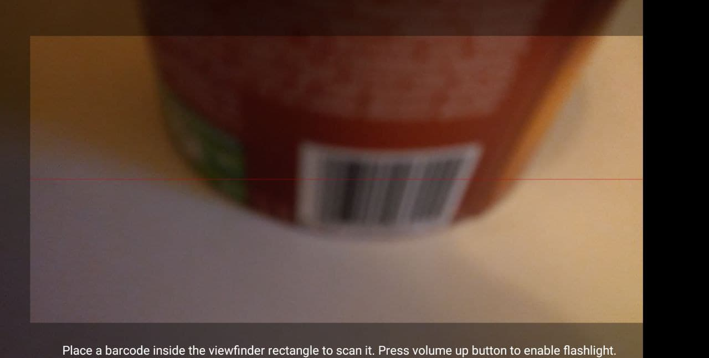
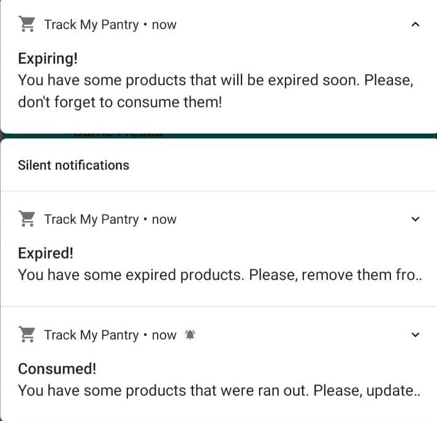

# TrackMyPantry

### Track My Pantry is a multi-user application, that keeps track of the groceries bought through their barcodes and builds up a collaborative database of barcodes.

## Login and Register
### You must first register and then log in to use this application.
 

## Home
### After log in you can see the list of items in your pantry. To find a product from collaborative database just press on search icon on the app bar and insert or scan a barcode. If you want to add a product from the remote list just press + on the item's card. You can also insert your product if you did not find it in the list. Press + icon in the right bottom of the screen.

 

## Add item
### You can simply add a product into your pantry defining name, description, barcode, category and expiry date.

## Product information
### You can check full information about a product in your pantry. You can change it’s quantity or you can even remove it.

## Scan barcode
### You can scan a barcode by a camera. To enable a flashlight just press the volume up.

## Notifications
### Every day you can receive notifications that some products are ran out, expired or are about to expire.

